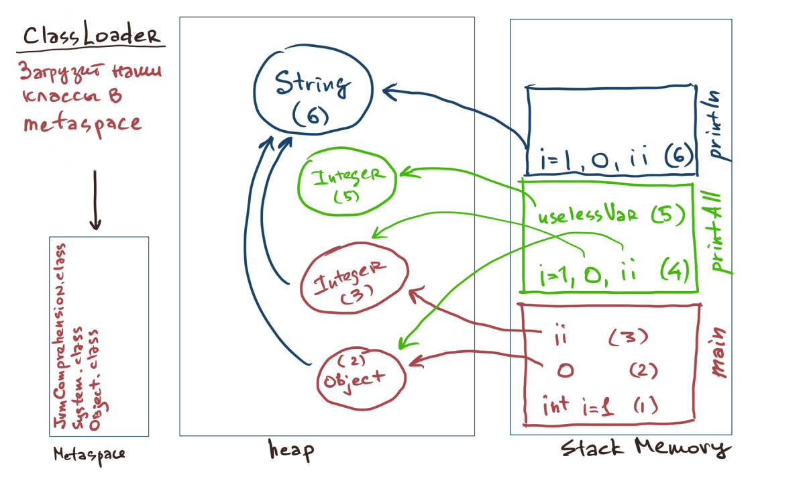

# Домашняя работа "Понимание JVM"
## Код для исследования
```java
public class JvmComprehension {
    public static void main(String[] args) {
        int i = 1;                      // 1
        Object o = new Object();        // 2
        Integer ii = 2;                 // 3
        printAll(o, i, ii);             // 4
        System.out.println("finished"); // 7
    }
    private static void printAll(Object o, int i, Integer ii) {
        Integer uselessVar = 700;                   // 5
        System.out.println(o.toString() + i + ii);  // 6
    }
}
```
`ClassLoader` подгружает все классы в `Metaspace`. 
`JvmComprehension` через `ApplicationClassLoader`, системные классы через `BootstrapClassLoader`.



## Шаги:
1. Сначала в `Stack Memory` создается фрейм под метод `main`. Выделяется место под переменную int i = 1
2. В `Heap` выделяется место под класс `new Object`, далее в `Stack Memory` в `main` создается ссылка на это место `Object o`
3. Тоже самое происходит с `Integer ii`
4. В `Stack Memory` выделяется место под метод `printAll`, создаются ссылки на существующие уже объекты `Integer`,`Object`. Выделяется место под переменную int i=1
5. В `Heap` выделяется место под класс `Integer`, далее в `Stack Memory` в `main` создается ссылка на это место `Integer uselessVar`
6. В `Stack Memory` выделяется место под метод `println` класса `System`. Из аргументов метода создается `String` и выводится на печать.
Т.к. все действия закончены, то все объекты разблокируются для сборщика мусора.
 
