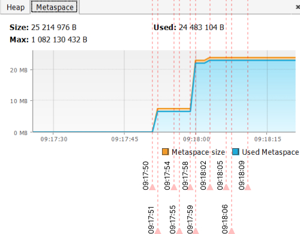

# Домашняя работа "Исследование JVM через VisualVM"
## Код для исследования
```java
Please open 'ru.netology.JvmExperience' in VisualVm
09:17:50.862409300: loading io.vertx
09:17:51.543621500: loaded 529 classes
09:17:54.556837700: loading io.netty
09:17:55.826086500: loaded 2117 classes
09:17:58.830296900: loading org.springframework
09:17:59.324852300: loaded 869 classes
09:18:02.339608: now see heap
09:18:02.340041300: creating 5000000 objects
09:18:02.868595600: created
09:18:05.873920600: creating 5000000 objects
09:18:06.196149100: created
09:18:09.296671900: creating 5000000 objects
09:18:09.593711500: created
```


## Вкладка Classes
+ c 9:17:50 по 9:17:51 создаются 529 классов из фрейма `Vetrx`
+ c 9:17:54 по 9:17:55 создаются 2117 классов из фрейма `Netty`
+ c 9:17:58 по 9:17:59 создаются 869 классов из фрейма `Spring`
+ далее создается только один класс
<br>


## Вкладка Metaspace
+ 
